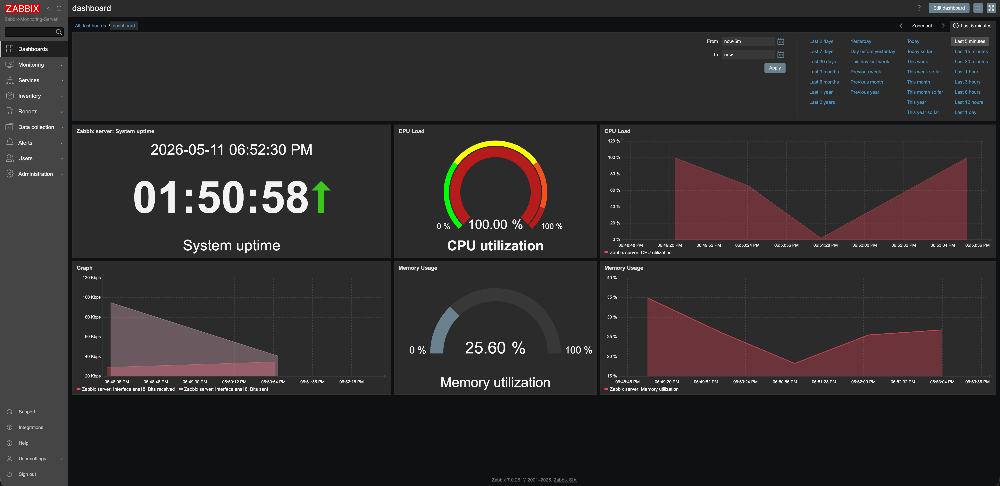
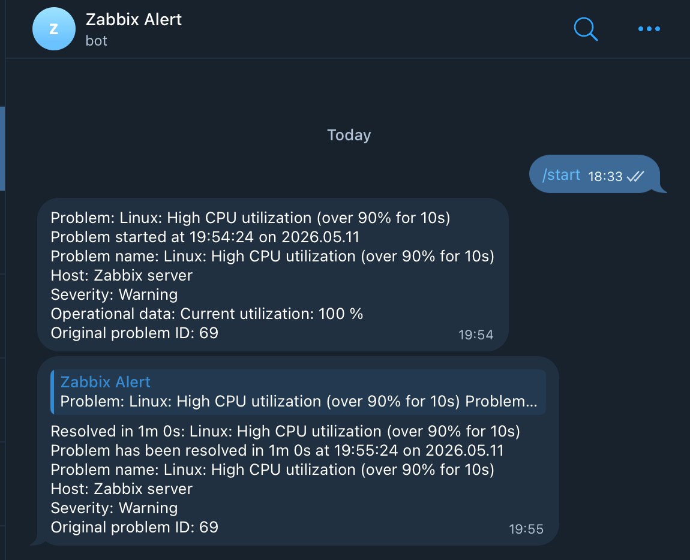

# 📊 Zabbix ile Kurumsal Sunucu İzleme Altyapısı

## 📌 Proje Özeti
Bu proje, boş bir 500GB M.2 disk üzerine kurulan Proxmox sanallaştırma ortamındaki Ubuntu Server'ın sağlık ve performans durumunu 7/24 izlemek için tasarlanmış bir altyapı çalışmasıdır. Sistemdeki darboğazları önceden tespit etmek amacıyla bilinçli stres testleri uygulanmış ve anlık uyarı mekanizmaları kurgulanmıştır.

## 🚀 Kullanılan Teknolojiler
* **Sanallaştırma:** Proxmox VE
* **İşletim Sistemi:** Ubuntu Server
* **İzleme & Metrik:** Zabbix 7.0 LTS (Agent & Server)
* **Veritabanı & Web:** PostgreSQL, Nginx (Reverse Proxy)
* **Uzaktan Erişim & Güvenlik:** Cloudflare Tunnels
* **Bildirim Sistemi:** Telegram Webhook

## ⚙️ Kurulum ve Mimari Süreci
1. **Veritabanı ve Servisler:** Ubuntu Server üzerine PostgreSQL veri tabanı kurularak Zabbix Server ve Agent yapılandırmaları tamamlandı.
2. **Reverse Proxy (Nginx):** Zabbix'in web arayüzü ile Nginx'in varsayılan sayfası arasındaki çakışma giderilerek, Nginx bir ters vekil (Reverse Proxy) olarak yapılandırıldı.
3. **Güvenli Uzaktan Erişim:** Sisteme ağ dışından güvenli bir şekilde erişebilmek (Remote Access) için Cloudflare Tunnels entegrasyonu yapıldı.
4. **Alarm Mekanizması:** Sistem yükü eşik değerleri (threshold) aştığında sistem yöneticisine bildirim gönderecek Telegram Bot (Webhook) oluşturuldu.

## 📈 Sistem Testi ve Sonuçlar
Sistemin tepkisini ve monitörleme hızını ölçmek için Zabbix veri çekme (Get Data) periyodu **5 saniyeye** düşürüldü. Ardından Linux terminali üzerinden `stress --cpu 4 --vm 1 --vm-bytes 1G --timeout 60` komutuyla sunucu yük altına sokuldu.

* **Sonuç:** Zabbix Dashboard'undaki "CPU Utilization" ibresi anında kırmızı bölgeye ulaşarak darboğazı tespit etti ve Telegram botu üzerinden başarılı bir şekilde **"High CPU utilization"** uyarısı gönderildi.

## 📸 Ekran Görüntüleri

### Zabbix Monitoring Dashboard

### Telegram Uyarı Sistemi

